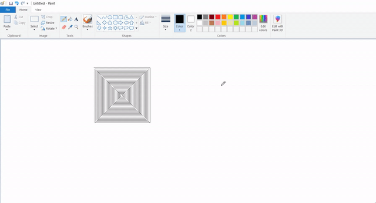

# Python Auto Draw
##### THIS SIMPLE PROJECT WAS MADE TO LEARN PYTHON LIBRARY FUNCTIONS LIKE `pyatogui` & `time`.

### *DEMO*:

### To run it on your PC:
* Make sure you have Python 3.7.x or Python 3.8.x installed, if not, click [here](https://www.python.org/downloads/) to install! 
* Install PyAutoGUI: `pip install pyautogui`
* Clone this into your Desktop: `git clone "https://github.com/tusharnankani/PythonAutoDraw"`
* Open Command Line or Terminal 
* Change directory to a respective game: `cd "Desktop\PythonAutoDraw"`
* Run: `python python-auto-draw.py`

### BASICS:
<code>
>>> import pyautogui
</code>
>>> import pyautogui
`
>>> screenWidth, screenHeight = pyautogui.size() # Get the size of the primary monitor.

>>> currentMouseX, currentMouseY = pyautogui.position() # Get the XY position of the mouse.

>>> pyautogui.moveTo(100, 150) # Move the mouse to XY coordinates.

>>> pyautogui.click()          # Click the mouse.
>>> pyautogui.click(100, 200)  # Move the mouse to XY coordinates and click it.
>>> pyautogui.click('button.png') # Find where button.png appears on the screen and click it.

>>> pyautogui.move(0, 10)      # Move mouse 10 pixels down from its current position.
>>> pyautogui.doubleClick()    # Double click the mouse.
>>> pyautogui.moveTo(500, 500, duration=2, tween=pyautogui.easeInOutQuad)  # Use tweening/easing function to move mouse over 2 seconds.

>>> pyautogui.write('Hello world!', interval=0.25)  # type with quarter-second pause in between each key
>>> pyautogui.press('esc')     # Press the Esc key. All key names are in pyautogui.KEY_NAMES

>>> pyautogui.keyDown('shift') # Press the Shift key down and hold it.
>>> pyautogui.press(['left', 'left', 'left', 'left']) # Press the left arrow key 4 times.
>>> pyautogui.keyUp('shift')   # Let go of the Shift key.

>>> pyautogui.hotkey('ctrl', 'c') # Press the Ctrl-C hotkey combination.

>>> pyautogui.alert('This is the message to display.') # Make an alert box appear and pause the program until OK is clicked.
`

## *REFERENCES*:
- [PyAutoGUI Docs](https://pypi.org/project/PyAutoGUI/)
- [More about PyAutoGUI](https://pyautogui.readthedocs.io/en/latest/mouse.html#mouse-drags)
